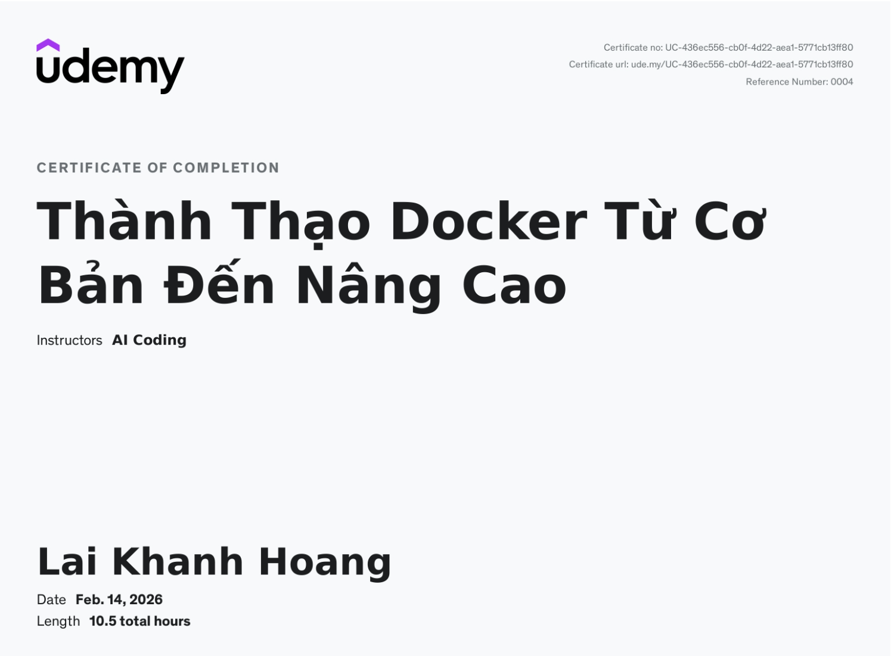
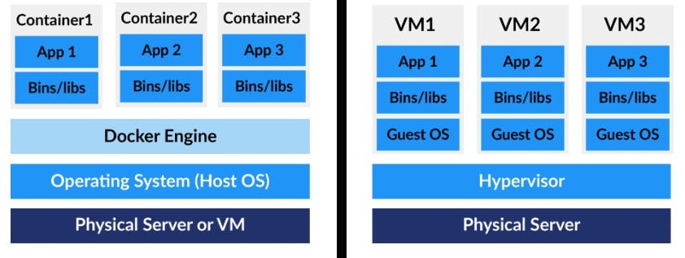
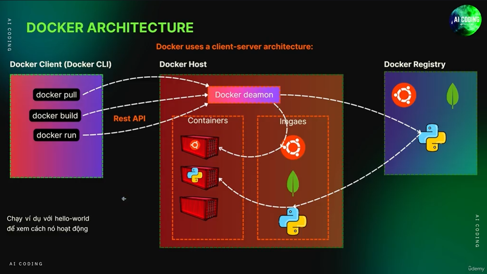
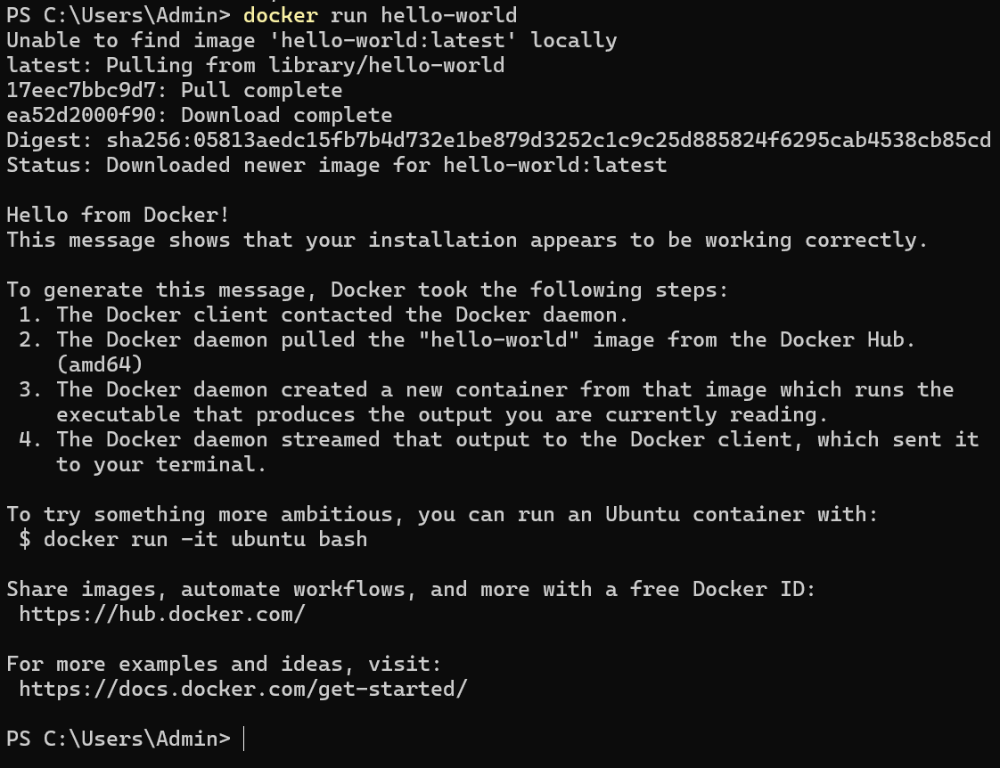
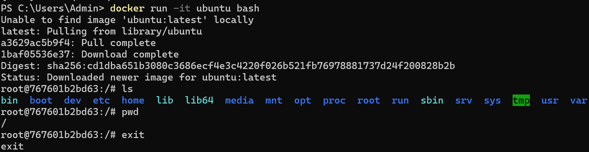
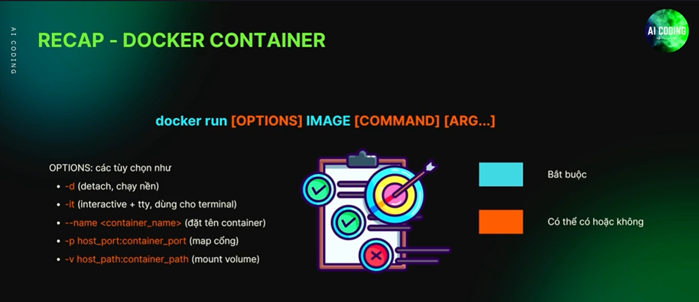

# Thành Thạo Docker Từ Cơ Bản Đến Nâng Cao


Đây là repo cho khóa học về Docker trên Udemy. Khóa học bao gồm lí thuyết và thực hành cơ bản về các nội dung trong Docker như Image, Container, Dockerfile,...

<p align="center">
    
</p>


## Mục lục

- [Section 02 - Tổng quan về Docker](#section-02)
- [Section 03 - Cài đặt Docker và môi trường](#section-03)
- [Section 04 - Kiến trúc Docker](#section-04)
- [Section 05 - Docker Containers và Commands liên quan](#section-05)
- [Section 06 - Docker Image](#section-06)
- [Section 07 - Dockerfile & Build Docker Image](#section-07)
- [Section 08 - Docker Storage & Mounting](#section-08)
- [Section 09 - Docker Network](#section-09)
- [Section 10 - Docker Compose](#section-10)
- [Section 11 - Docker Swarm](#section-11)
- [Section 12 - Docker Registry](#section-12)


## Fundamental

<details>
<summary><strong>IP và Port trong mô hình Server – Docker – Application</strong></summary>
    <ul>
        <li>
            Mỗi server có một định danh duy nhất trên Internet gọi là <strong>IP</strong>.
            <strong>Port</strong> là cổng giao tiếp logic trên server, dùng để xác định
            <em>dịch vụ nào</em> sẽ nhận request (ví dụ: web server, database, API).
        </li>
        <li>
            <strong>Port của server (host port)</strong> và
            <strong>port của container (container port)</strong> là <strong>hai khái niệm khác nhau</strong>.
            Docker sử dụng cơ chế port mapping để chuyển request từ port của server
            vào đúng port mà ứng dụng đang lắng nghe bên trong container.
        </li>
        <li>
            Ứng dụng (ví dụ: FastAPI / Django chạy bằng Uvicorn hoặc Gunicorn)
            <strong>chỉ lắng nghe port bên trong container</strong> và không biết gì
            về IP hay port bên ngoài của server.
        </li>
    </ul>
    <p><strong>Ví dụ 1: Chạy FastAPI trong Docker</strong></p>
    <ul>
        <li>
            Uvicorn chạy bên trong container và lắng nghe tại
            <code>0.0.0.0:8000</code>.
        </li>
        <li>
            Docker được cấu hình port mapping:
            <code>-p 8080:8000</code>.
        </li>
        <li>
            Người dùng gọi API bằng đường dẫn:
            <code>http://&lt;server_ip&gt;:8080</code>.
        </li>
        <li>
            Docker chuyển request từ
            <code>server:8080</code> vào
            <code>container:8000</code>, nơi Uvicorn xử lý request.
        </li>
    </ul>
    <p><strong>Ví dụ 2: Chạy nhiều container cùng một ứng dụng</strong></p>
    <ul>
        <li>
            Hai container đều chạy ứng dụng lắng nghe tại port
            <code>8000</code> bên trong container.
        </li>
        <li>
            Docker map ra các port khác nhau trên server:
            <code>-p 8001:8000</code> và <code>-p 8002:8000</code>.
        </li>
        <li>
            Người dùng truy cập:
            <code>http://&lt;server_ip&gt;:8001</code> hoặc
            <code>http://&lt;server_ip&gt;:8002</code>.
        </li>
        <li>
            Mỗi request được chuyển vào đúng container tương ứng,
            dù ứng dụng trong container đều dùng cùng một port.
        </li>
    </ul>
</details>

<details>
<summary><strong>Port</strong></summary>
    <ul>
        <li>
        Port là cổng logic trên một máy tính, dùng để phân biệt các service/chương trình cùng dùng 1 IP. Mỗi service “nghe” trên một port riêng, ví dụ Postgres mặc định là 5432. Khi bạn connect client (PgAdmin, psql, browser), IP + port định danh đúng service cần giao tiếp. Một port trên cùng host chỉ có thể có một process nghe; nếu có 2 server cùng port trên host → lỗi.
        </li>
        <li>
        Trong Docker, mỗi container có container port riêng (Postgres luôn 5432), host port chỉ là “cửa ra vào” để connect từ host. Bạn có thể map host port khác nhau cho nhiều container cùng port nội bộ (5432:5432, 5433:5432). Docker network cho phép container kết nối bằng service name mà không cần host port. PgAdmin connect đến host port → Docker NAT/forward → container port → server xử lý.
        </li>
    </ul>
</details>


## Section 02

<p align="center">
    Tổng quan về Docker
</p>

- Docker là một nền tảng mã nguồn mở dùng để phát triển, đóng gói, và chạy các ứng dụng trong những môi trường cách ly gọi là container.

    Key concepts:
    - Containerization: Một hình thức ảo hóa nhẹ, dùng để đóng gói ứng dụng cùng với các thư viện/phụ thuộc của nó.
    - Docker Engine: Môi trường chạy (runtime) cho phép bạn build và run các container.
    - Docker Image: Một khuôn mẫu chỉ đọc (read-only) dùng để tạo ra container.
    - Docker Container: Một instance có thể chạy (runnable instance) của Docker image (đã chứa đầy đủ code và thư viện, sẵn sàng chạy).
    - Docker Hub: Một registry trên nền tảng đám mây dùng để lưu trữ và chia sẻ Docker image.

    - Ví dụ:

        ```
        - Dockerfile 	    = tờ giấy hướng dẫn cho đầu bếp
        - Docker Image 	    = kho nguyên liệu + nồi nước dùng đã nấu xong
        - Docker (Engine)   = hệ thống bếp + đầu bếp (Đọc Dockerfile - Nấu ra image - Dùng image để bưng phở)
        - Container 	    = tô phở đang được bưng ra bàn 
        ```

- Why Docker?

    - Giải quyết vấn đề chạy được trên máy mình, mà không chạy được trên máy đồng nghiệp.
    - Benefits of Docker:
        - Consistency: Chạy được trên các môi trường khác nhau.
        - Efficiency: Nhẹ, so với VM.
        - Isolation: Không bị xung đột giữa các containers với nhau.
        - Portability: Hoạt động trên mọi platform support Docker, kể cả không trùng OS.
        - Scalability: Scale ngang bằng cách deploy nhiều containers giống nhau.
        - Versioning: Support việc version các image, dễ dàng update và rollback.

- VMs and Docker Containers

    <p align="center">
        
    </p>

    <div align="center">

    | Virtual Machines (VMs) | Containers |
    |------------------------|------------|
    | Nặng (bao gồm toàn bộ hệ điều hành) | Nhẹ (chia sẻ hệ điều hành host) |
    | Khởi động chậm | Khởi động trong vài giây |
    | Sử dụng nhiều tài nguyên | Sử dụng tài nguyên tối thiểu |
    | Phù hợp khi bảo mật là ưu tiên hàng đầu | Phù hợp khi tốc độ là ưu tiên |

    </div>

    VMs có môi trường độc lập nên khó bị tấn công hơn. Trong khi đó Containers dựa trên Host OS do đó nếu Host OS bị tấn công, các containers vẫn có thể gặp nhiều rủi ro.


## Section 03

<p align="center">
    Cài đặt Docker và môi trường 
</p>

## Section 04

<p align="center">
    Kiến trúc Docker
</p>

- Các khái niệm chính

    - Docker Engine: runtime core giúp build, run và quản lý containers.
        <p align="center">
            Docker Engine = Docker Daemon + Docker CLI + API
        </p>

        - Docker CLI: Giao diện command-line (thường là terminal) để giao tiếp với Docker.
        - Docker CLI và Docker Daemon giao tiếp thông qua API.
        - Docker Daemon (dockered): Background service dùng để quản lý Docker containers, images, networks và volumes.
        - Docker Images: Read-only Templates gồm chồng (stack) các filesystem layer bất biến (immutable) dùng để tạo container.
        - Docker Containers: Các instance của images - nhẹ và có thể chạy được.
        - Dockerfile: Một file text hướng dẫn build một Docker Image.
        - Docker Hub/ Docker Registry: Một kho lưu và chia sẻ Docker Images.
        - Docker Compose: Một tool dùng để định nghĩa và chạy ứng dụng nhiều containers sử dụng một file YAML.
        - Docker Volumes: Phương pháp lưu trữ lâu dài cho các containers.
        - Docker Networks: Quản lí giao tiếp giữa các containers và với thế giới bên ngoài.

- Kiến trúc Docker

    <p align="center">
        
    </p>

    - Docker CLI:
        - Thường sẽ làm việc qua CLI (comman line interface)
        - User nhập lệnh qua CLI
        - Lệnh được chuyển thành request gửi đến Docker Daemon và đợi phản hồi.

    - Docker host: là máy (vật lý hoặc ảo) mà Docker Daemon đang chạy trên đó.

        Ví dụ: Chạy lệnh "docker run ..."
        - Nhận yêu cầu từ CLI.
        - Kiểm tra xem image có sẵn chưa.
        - Nếu chưa có thì pull từ Registry về rồi khởi tạo container.
        - Nếu có rồi thì khởi tạo Container luôn.
        - Gửi trả thông tin về CLI.

    - Docker Registry: Nơi lưu trữ và chia sẻ Docker Images, cho phép push sau khi build và pull về để chạy container.

## Section 05

<p align="center">
    Docker Commands và Containers
</p>

- Docker Container:

    - Docker Image là bản đóng gói bất biến gồm:
        - Code ứng dụng
        - Thư viện / dependencies
        - Runtime (Python, Node, Java…)
        - Cấu hình hệ thống cần thiết (OS layer, env, v.v.)

    - Docker Container là instance đang chạy của image.
    - Từ một image, có thể tạo nhiều container.
    - Để chạy một container từ container:
    
        ```
        docker run <image_name>
        docker run --name <container_name> <image_name>
        ```

        <details>
        <summary> Demo Docker container - hello-world </summary>

        - Chạy câu lệnh "demo run hello-world"

        <p align="center">
            
        </p>

        - Có thể thấy: Daemon không tìm thấy container trong Registry nên tìm kiếm trên Docker Hub.

        
        </details>

        <details>
        <summary> Demo Docker container - ubuntu </summary>

        - Chạy câu lệnh "demo run -it ubuntu bash"
            - **`-it`**: **`-i`**(interactive) cho phép gõ lệnh vào container và **`-t`** (tty) cho phép bạn thực hiện một số quyền khác (prompt đẹp, Ctrl+C, Clear screen và history,...)
            - **`-bash`**: override CMD, chạy bash

        <p align="center">
            
        </p>

        - Có thể thấy: Ta có thể thực hiện trực tiếp các câu lệnh như terminal.
        </details>

<br>

- Commands với Docker Container:

    |Lệnh|Hành động|
    |--------------|---------|
    |docker start <container_id_or_name>|**Chạy** container đã bị dừng, còn nếu container đang chạy thì sẽ không làm gì.|
    |docker restart <container_id_or_name>|**Khởi động** container khi nó đã dừng, còn nếu container đang chạy thì sẽ dừng rồi restart container. <br> Thường dùng khi Docker gặp lỗi không nhận GPUs.|
    |docker run -d <image_name>|**Chạy container** ở background|
    |docker run -it <image_name> /bin/bash <br> (hoặc bash)|**Chạy container** và thao tác với nó <br> **`-it`** là kết hợp của -i (interactive) và -t (psuedu-TTY), cho phép tương tác với container thông qua terminal, <br> thiếu một trong hai cái thì output sẽ không được định dạng hoặc chúng ta không tương tác được.|
    |docker exec -it <container_id_or_name> <command>|**Thực thi command** trong một container đang chạy (thường được sử dụng trong detached mode). <br> Xem thêm ở **Ghi chú**. <span style="color:red;"><strong>QUAN TRỌNG</strong></span> |
    |docker stop <container_id_or_name>|**Dừng** container.|
    |docker run -p <host_port>:<container_port> <image_name>|**Map cổng** của container tới cổng của máy host. <br> Xem thêm ở **Ghi chú**.|
    |docker ps|**Liệt kê** các docker đang chạy.|
    |docker ps -a|**Liệt kê** tất cả các docker đã sử dụng.|
    |docker inspect <container_id_or_name>|**Trả về** một file JSON lớn chứa metadata về container.|
    |docker logs <container_id_or_name>|**Xem** container **logs** (xem log** của container đến thời điểm hiện tại).|
    |docker logs -f <container_id_or_name>|**Theo dõi** container **log real-time** (xem log được update liên tục khi container đang chạy khi muốn monitor real-time).|
    |docker rm <container_id_or_name>|**Xóa** một container đã **không còn chạy** nữa.|
    |docker rm -f <container_id_or_name>|**Xóa** một container **đang chạy** (vì container vẫn running nên phải thêm option -f (force)).|
    |docker container prune|**Xóa** các container **đã dừng** (thêm "-f" sau "prune" để tự động đồng ý mà không cần xác nhận).|


    Labs: [Link](labs/sec_05/)

    <details>
    <summary><strong>Ghi chú</strong></summary>

    <ul>
        <li>
        Xem ví dụ về <strong>Port Mapping</strong> ở
        <a href="labs/sec_05/README.md/#port-mapping">đây</a>.
        </li>
        <li>
        <strong>Log của container</strong> là toàn bộ những gì ứng dụng bên trong container
        ghi ra <code>stdout</code> và <code>stderr</code> trong quá trình chạy.
        Docker không tự tạo log riêng, mà chỉ thu lại output của tiến trình chính
        trong container.
        <br>
        <em>Ví dụ:</em> bạn chạy một container Django, khi có request
        <code>/login</code>, Django in ra dòng như
        <code>POST /login 200</code>; hoặc khi lỗi, Python in traceback ra terminal.
        Tất cả những dòng đó được Docker gom lại và bạn xem bằng lệnh
        <code>docker logs &lt;container_name&gt;</code>.
        </li>
    </ul>

    </details>

<br>

- Restart Policy
    - Các option của Restart Policy:

        |Option|Chức năng|
        |------|---------|
        |**no**|Test, Dev bình thường <br> Mặc định khi không thêm flag --restart. <br> Container không tự khởi động lại|
        |**always**|Task rất quan trọng. <br> Container luôn khởi động lại khi dừng. <br> Nếu chúng ta chủ động dừng container qua lệnh **`docker stop`** thì container khởi động lại khi Docker Daemon khởi động lại.|
        |**on-failure[:max-retries]**|Chỉ khởi động lại khi container thoát với lỗi exit code # 0. <br> Có thể giới hạn số lần retry. <br> Nếu chúng ta chủ động dừng container qua lệnh **`docker stop`** thì container **không tự khởi động lại** khi Docker Daemon khởi động lại.|
        |**unless-stopped**|Giống **always** nhưng **không tự khởi động lại** nếu chủ động dừng container qua lệnh **`docker stop`**|

<br><br>

<p align="center">
    
</p>


## Section 06
<p align="center">
    Docker Image
</p>

- Docker image: là một đơn vị nhỏ gọn, độc lập và có thể chạy được, chứa đầy đủ mọi thành phần cần thiết để thực thi một ứng dụng — bao gồm mã nguồn, môi trường runtime, các công cụ cần thiết, thư viện, và các thiết lập cấu hình. Docker image đóng vai trò là nền tảng để tạo ra container.

    |||
    |--|--|
    |Layers (Các lớp)|         Một image được xây dựng từ nhiều lớp, mỗi lớp đại diện cho một tập các thay đổi trên hệ thống file.|
    |Base Image (Image nền)|   Điểm khởi đầu của một image, thường là phiên bản tối giản của một hệ điều hành.|
    |Parent Image (Image cha)| Image mà một image khác được kế thừa hoặc xây dựng dựa trên.|
    |Image Tags (Thẻ image)|   Các nhãn mô tả giúp định phiên bản và nhận diện image.|
    |Image ID|                 Một chuỗi hash duy nhất dùng để phân biệt image này với image khác.|

<br>

- Commands với Docker Image:

    |||
    |--|--|
    |Lệnh|Công dụng|
    |**`docker pull <image_name>:<tag>`**|**Tải** image về từ [Docker Hub](https://hub.docker.com/).|
    |**`docker images`**|**Liệt kê** các docker images đang có trong máy. <br>  Cách viết tương tự nhưng chính quy, rõ nghĩa, tuân theo cú pháp phân cấp của Docker CLI **`docker <object> <command>`** là: **`docker images ls`**.|
    |**`docker inspect <image_name>:<tag>`**|**Hiển thị** thông tin chi tiết dạng JSON về một Docker Image, bao gồm cấu hình, môi trường,...|
    |**`docker tag <source_image>:<tag> <target_images>:<tag>`**|**Đổi tên** một image đang tồn tại.|
    |**`docker rmi <image_name>:<tag>`** <br> **`docker rmi <image_id>`**|**Xóa** docker image đang có trong máy. <br> **Tuy nhiên** nếu Docker Image đang gắn với một container nào đó thì hệ thống sẽ cảnh báo, vì Container tham chiếu tới image. Cách viết tương tự nhưng chính quy, rõ nghĩa, tuân theo cú pháp phân cấp của Docker CLI **`docker <object> <command>`** là: **`docker image rm <image_name>:<tag>`**.|
    |**`docker image prune`**|**Xóa** các dangling images, thường không có tag **`<none>:<none>`**. <br> Thêm **`-a`** vào đằng sau để xóa tất cả image không được container nào sử dụng.|
    |**`docker system prune`**|**Dọn dẹp** toàn bộ tài nguyên không cần thiết trong Docker: các container đã dừng, các network không sử dụng, images không còn liên kết và các volume không sử dụng.|

## Section 07
<p align="center">
    Dockerfile
</p>

- Dockerfile là một file văn bản chứa các lệnh để tự động hóa quá trình tạo Docker Image. Nó định nghĩa môi trường, dependencies và cách chúng ta chạy ứng dụng.

    - Cấu trúc cơ bản:
        - Mỗi dòng trong Dockerfile là một instruction.
        - Mỗi instruction tạo ra một layer trong image.
        - Dockerfile thường bắt đầu bằng FROM để chỉ định base image.

- Docker instructions là các lệnh được viết trong Dockerfile để hướng dẫn Docker cách xây dựng một image. Mỗi instruction là một từ khóa viết in hoa và thường đi kèm tham số.
    - Mỗi instruction tương ứng với một bước tạo ra image.

        Ví dụ:

        ```dockerfile
        FROM python:3.9-slim
        WORKDIR /app
        COPY requirements.txt
        RUN pip install -r requirement.txt
        COPY . .
        EXPOSE 8000
        CMD ["uvicorn", "main:app", "--host", "0.0.0.0", "--port", "8000"]
        ```

    - Một số Docker instructions khác:
        - **`LABEL`**: để gắn metadata (siêu dữ liệu) cho image (dưới dạng cặp key-value)
            - Thêm thông tin mô tả về image như version, ai tạo ra, mục đích ...
            - Giúp việc tìm kiếm sau này dễ hơn
        - **`ARG`**: khai báo biến:
            - Định nghĩa biến chỉ dùng trong quá trình docker build
            - Cho phép truyền giá trị vào khi build bằng --build-arg
            - Sau khi build xong, container không thể truy cập biến ARG
        - **`ENV`**:
            - Khai báo biến môi trường trong image.
            - Biến này tồn tại cả trong quá trình build lẫn khi container chạy
            - Biến môi trường được khai báo bằng ENV có thể bị ghi đè khi chạy container bằng cách sử dụng cờ -e hoặc --env trong lệnh docker run.
            - Có thể kiểm tra bằng docker inspect container_name_or_id
        - So sánh:
            | Tiêu chí                 | `ARG`                                 | `ENV`                                     | `LABEL`                           |
            | ------------------------ | ------------------------------------- | ----------------------------------------- | --------------------------------- |
            | Mục đích                 | Tham số cho **quá trình build image** | Biến môi trường cho **ứng dụng khi chạy** | **Metadata** mô tả image          |
            | Thời điểm tồn tại        | **Build time**                        | **Runtime**                               | Build & runtime                   |
            | Có vào container không   | ❌                                     | ✅                                         | ❌                                 |
            | App bên trong đọc được   | ❌                                     | ✅                                         | ❌                                 |
            | Override khi nào         | `docker build --build-arg`            | `docker run -e`, Docker Compose, K8s      | Chỉ khi build                     |
            | Ảnh hưởng đến image hash | ✅                                     | ✅                                         | ✅                                 |
            | Dùng cho config app      | ❌                                     | ✅                                         | ❌                                 |
            | Dùng cho version / info  | ⚠️ (ít dùng)                          | ⚠️                                        | ✅                                 |
            | Ví dụ điển hình          | Base image version                    | `APP_ENV`, `DB_HOST`                      | `version`, `maintainer`, `source` |
        - **`COPY`**:
            - Chỉ sao chép file/ thư mục, không xử lý .tar, không tải file từ URL.
            - Đơn giản, rõ ràng nnê được ưu tiên sử dụng.
        - **`ADD`**: Ngoài việc sao chép file từ COPY, còn:
            - Tự động giải nén nếu source là .tar, .tar.gz,...
            - Hỗ trợ URL - tải file từ Internet.
        - **`CMD`** và **`ENTRYPOINT`** đều được dùng để chỉ định lệnh mặc định sẽ chạy khi container được khởi động.
            - **`CMD`** - Lệnh mặc định có thể bị ghi đè nếu truyền lệnh mới khi **`docker run`**.
            - **`ENTRYPOINT`** Lệnh cố định khó bị ghi đè. Nếu truyền đối số khi chạy container, nó sẽ gán vào sau lệnh **`ENTRYPOINT`**.
        - **`EXPOSE`** được dùng để khai báo port mà container sử dụng để giao tiếp bên ngoài. Chỉ dùng để tài liệu hóa, không có tác dụng mở cổng thực sự. Phải dùng **port mapping** khi chạy container.

- Build Docker Image:
    - Lệnh hay dùng: **`docker build -t <image_name>:<image_tag> .`**
        - **`.`**: là thư mục hiện tại đang đứng khi chạy lệnh trên, còn gọi là build context. 
        - Mặc định sẽ tìm Dockerfile trong build context.
    - Bản đầy đủ: **`docker build -f <path_to_Dockerfile> -t <image_name>:<image_tag> <build_context_path>`**
        
        Ví dụ:
        - Cấu trúc project:

            ```
            my-project/
            ├─ docker/
            │  └─ Dockerfile
            ├─ src/
            │  ├─ app.py
            │  └─ requirements.txt
            └─ .github/
            ```
        
        - Nội dung Dockerfile:

            ```dockerfile
            FROM python:3.11-slim

            WORKDIR /app

            COPY src/requirements.txt .
            RUN pip install --no-cache-dir -r requirements.txt

            COPY src/ .

            CMD ["python", "app.py"]
            ```

        - Lệnh build:

            ```bash
            docker build -f docker/Dockerfile -t myapp:1.0.0 .
            ```

- Tối ưu build Docker Image:
    - Khi Docker build Image, nó xây dựng theo kiểu layered architecture. Mỗi dòng trong Instruction tạo thành một layer mới trong Docker Image chỉ với sự thay đổi so với layer trước đó.
    - Docker sử dụng layered architecture này để tái sử dụng cache và giảm dung lượng.
    - Khi build lại image, Docker sẽ dùng lại layer cũ nếu nội dung không đổi, giúp build nhanh hơn.
    - Mẹo tối ưu Dockerfile:
        - Sắp xếp các instruction ít thay đổi lên trước, để tận dụng cache.
        - Gộp nhiều **`RUN`** lại bằng **`&&`** để giảm số layer.
         

## Section 08

<p align="center">
    Docker Storage & Mounting
</p>

- Docker container gồm:
    - Image Layers (Read-only):
        - Không thể modify trực tiếp.
        - Được share giữa nhiều contaniers.
        - Cached để tái sử dụng.

    - Container Layers (Read-write):
        - Khi tạo container, Docker tạo container layer.
        - Lưu trữ dữ liệu được tạo bởi container (logs, tempfile,...)
        - Tuy nhiên khi container bị xóa, container layer cũng sẽ mất.

    - Lưu ý: Giả sử như khi ta **build lại Image cho Postgreql**, nếu không có chỗ lưu lại dữ liệu production, **khi xóa Docker cũ, dữ liệu sẽ mất hết**. Do đó ta cần lưu dữ liệu ở chỗ khác.

- Mounting:
    - Bind Mount:
        - Mount trực tiếp trên thư mục host vào container.
        - Đường dẫn tuyệt đối trên host.
    - Volume Mount:
        - Docker quản lý storage.
        - Lưu trong **`/var/lib/docker/volumes/<volume_name>/_data`**.

    - Lệnh:
        ```bash
        docker run -d --name <container_name> -v <host_path_or_volume_name>:<container_path>:<options> <image_name>
        ```

        Nghĩa là nếu dữ liệu mới được thêm vào **`<container_path>`** thì sẽ được chuyển sang **`<host_path>`** (bind mount) hoặc **`/var/lib/docker/volumes/<volume_name>/_data`** (volume mount) trên máy **host**.

## Section 09

<p align="center">
    Docker Network
</p>

- Docker Network tạo ra một hệ thống mạng ảo để:
    - Containers giao tiếp với nhau và với Internet.
    - Host truy cập vào Container.
    - Cô lập traffic giữa các applications.
    - Docker cung cấp nhiều Driver mạng tùy nhu cầu sử dụng.

- Khi cài đặt Docker, sẽ mặc định tạo ra 3 loại network:
    - Bridge
    - Host
    - Null
    - Ngoài ra còn 2 loại network khác:
        - Overlay: dùng trong Docker Swarm, cho phép container trên nhiều máy khác nhau giao tiếp với nhau
        - Macvian: Cho phép container có IP riêng trong mạng LAN như thể container là một máy thật. Phù hợp cho hệ tống yêu cầu địa chỉ IP tĩnh.

- HOST NETWORK
    - Tổng quan
        - Container sử dụng trực tiếp network stack của host.
        - Không có network isolation.
        - Performance tốt nhất nhưng có thể xảy ra port conflict.
    - Dùng khi:
        - Cần performance cao.
        - Network-intensive applications, monitoring tools.
        - Dev/test nhanh.

- BRIDGE NETWORK - DEFAULT BRIDGE NETWORK
    - Là Bridge Network mặc định cho tất cả container.
    - Tạo virtual bridge docker (như một switch) trên host.
    - Containers có IP riêng trong subnet (thường 172.17.0.0/16).
    - Container cùng bridge có thể giao tiếp với nhau.
    - Nhược điểm:
        - Containers chỉ giao tiếp qua IP, không qua tên.
        - Khó quản lý khi có nhiều containers.

- CUSTOM BRIDGE NETWORK
    - Tại sao cần ?
        - Containers có thể giao tiếp chỉ qua tên container -> Dễ dàng hơn.
        - Tách biệt networks cho các applications.
        - Kiểm soát tốt hơn về security và routing.
    - Lệnh:

        ```bash
        docker network create --driver bridge my-network
        ```

- NULL NETWORK:
    - Container hoàn toàn isolated, không có network access.
    - Không giao tiếp với bất kì container nào, kể cả host.
    - Dùng trong sandbox, kiểm thử bảo mật.

## Section 10

<p align="center">
    Docker Compose
</p>

- Docker Compose là công cụ giúp định nghĩa và chạy nhiều container với cấu hình trong một file YAML duy nhất.
    - Giúp dễ dàng quản lý các dịch vụ có phụ thuộc lẫn nhau (ví dụ: Web + Database).
    - Thay vì chạy từng **`docker run`**, ta chạy **`docker compose up`**.

- Commands:
    |||
    |--|--|
    |docker compose up|**Chạy** các container và hiển thị log ngay trên terminal|
    |docker compose up -d| **Chạy** container **ở chế độ nền** (detached mode) – terminal không bị chiếm|
    |docker compose up --build|**Chạy** container **nhưng ép build lại images** trước khi chạy|
    |docker compose ps| **Xem trạng thái** các container **đang chạy** từ Compose.|
    |docker compose stop| **Tạm dừng** các container, **không xóa** gì cả.|
    |docker compose down|**Dừng và xóa containers, network** do Docker Compose tạo ra (còn các options khác)|
    |docker compose restart| **Khởi động** lại **tất cả** container.|

- YAML File
    - Là một định dạng serialization dữ liệu được thiết kế dễ đọc và dễ viết.
    - Có đuôi là **.yaml** hoặc **.yml**, thường được dùng cho config file, Docker Compose, Kubernetes hoặc Github Actions.
    - Có thể thêm ghi chú bằng *`#`*; hỗ tợ string, number, array, object, null.
    - Quy tắc quan trọng:
        - Chỉ sử dụng Space, không dùng Tab.
        - Thường dùng 2 hoặc 4 spaces cho mỗi cấp, nhưng phải nhất quán.
        - Map/Object (key: value) và Sequence/Array (danh sách) là những thành phần cốt lõi của YAML file.
        - Ví dụ:

            ```yaml
            version: "3.9"
            services: 
                web:
                    image: nginx
            ```

            ```yaml
            - apple
            - banana
            - mango
            ```
- Khi Docker Compose, nó sẽ tạo một Bridge Custom Network để các services giao tiếp với nhau.


## Section 11

- Docker Swarm
    - Định nghĩa:
        - Swarm là orchestration tool tích hợp sẵn trong Docker Engine.
        - Cho phép quản lý nhiều container trên nhiều host như một cluster.

    - Khái niệm chính:
        - Node: máy chủ tham gia Swarm (manager hoặc worker).
        - Service: nhóm container cùng loại, quản lý scaling, update, restart.
        - Stack: tập hợp nhiều service, deploy bằng docker stack deploy từ YAML (docker-compose.yml).
        - Overlay Network: mạng ảo để container trên nhiều host giao tiếp.
    - Tính năng chính:
        - Scale service dễ dàng (replicas)
        - Load balancing nội bộ giữa các replica
        - Rolling update / rollback service
        - Restart policy khi container chết
    - So sánh với Kurbentes:
        | Feature          | Docker Swarm            | Kubernetes                 |
        | ---------------- | ----------------------- | -------------------------- |
        | Setup            | Cực dễ, tích hợp Docker | Phức tạp, nhiều thành phần |
        | Scale            | Có                      | Có + auto-scaling          |
        | Networking       | Overlay network sẵn     | Cực mạnh, nhiều plugin     |
        | Load balancing   | Internal LB             | Ingress hoặc service LB    |
        | Learning curve   | Thấp                    | Cao                        |
        | Production-ready | Nhỏ, medium             | Lớn, enterprise-grade      |
    - Cách deploy:
        ```bash
        docker swarm init                                   # khởi tạo Swarm trên manager
        docker stack deploy -c docker-compose.yml mystack   # deploy stack
        docker service ls                                   # xem service trong Swarm
        ```

## Section 12

<p align="center">
    Docker Registry
</p>

- Tag và Push Image lên Docker Hub:
    - Để tag một image đã có:
        **`docker tag <src_image>:<tag> <target_image>:<target_tag>`**
    - Push Image lên Docker Hub:
        - Login vào Docker Hub: **`docker login`**.
        - Push image: docker push **`<image_name>:<tag>`**.

- Lưu Docker Image:

|||
|-|-|
|**`docker save -o <file_name>.tar <image_name>:<image_tag>`**|Lưu vào file .tar (kích thước lớn)|
|**`docker load -i <file_name>.tar`**|Load lại Docker image từ file .tar|
|**`docker save <image_name>:<image_tag> \| gzip > <file_name>.tar.gz`**| Lưu Docker image vào file `.tar.gz` nén, kích thước nhỏ hơn. |
|**`docker load <<file_name>.tar.gz`** <br> **`docker load -i <file_name>.tar.gz`**|Load lại Docker image từ file gz.tar|


## Section 13

<p align="center">
    Dev in Docker Containers
</p>
