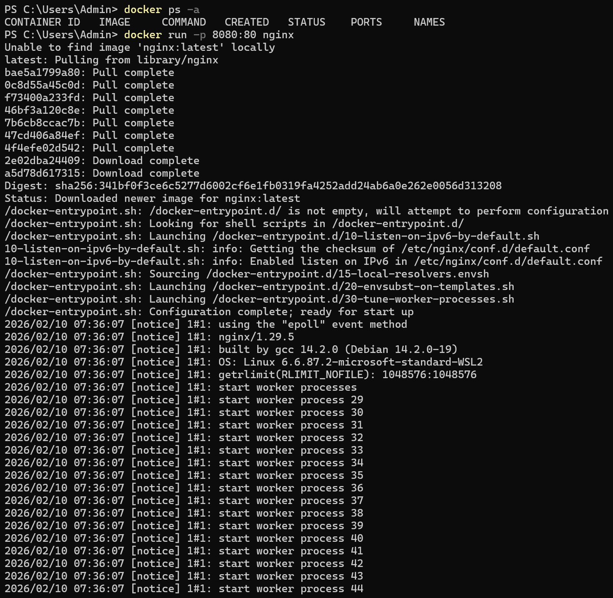
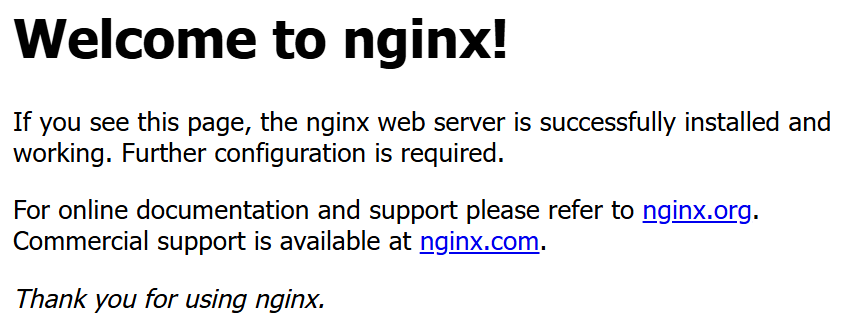

## Liệt kê các containers

    
     
    <em>Sử dụng <strong><code>docker ps</code></strong> và <strong><code>docker ps -a</code></strong> để liệt kê các containers</em>

## Xóa các containers

  

  <em>
    Sử dụng <strong><code>docker rm {container_id}</code></strong> và
    <strong><code>docker rm -f {container_id}</code></strong>
    để xóa các containers
  </em>

## Stop, start, restart Docker Containers

  

  <em>
    Sử dụng <strong><code>docker stop</code></strong>,  <strong><code>docker start</code></strong> và
    <strong><code>docker restart</code></strong>
    để sử dụng các containers
  </em>

## Port mapping 

- Chạy **`docker run -p 8080:80 nginx`**

    

    
    

    
    - nginx: là tên image, chạy một webserver mặc định trên cổng 80 bên trong container.
    - -p 8080:80: ánh xạ cổng 8080 trên máy host với cổng 80 trên container.

- Chạy **`http://localhost:8080`**

    

    
    

