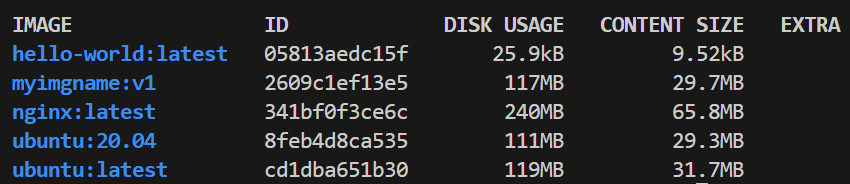
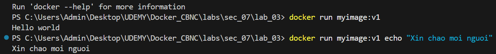
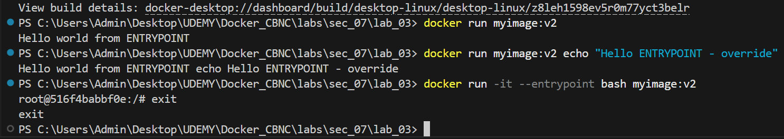

## 01 - Build image với Dockerfile - FROM, WORKDIR, COPY, CMD

- Cách chạy:

    ```bash
    cd ....\labs\sec_07\lab_01
    docker build -t myimgname:v1 .
    docker image ls
    ```

- Kết quả:
    <p align="center">
        
    </p>


## 02 - Build image với Dockerfile - RUN

- Cách chạy:

    ```bash
    cd ....\labs\sec_07\lab_02
    docker build -t demo_run:v1 .
    docker run demo_run:v1
    ```

## 03 - So sánh Docker instructions CMD và ENTRYPOINT
- CMD:
    - Chạy lệnh:
        ```bash
        cd ....\labs\sec_07\lab_03
        docker build -t myimage:v1 .
        docker run myimage:v1
        docker run myimage:v1 echo "Xin chao moi nguoi"
        ```
    - Kết quả:
        <p align="center">
            
        </p>


- ENTRYPOINT:
    - Chạy lệnh:
        ```bash
        # Chỉnh sang CMD
        cd ....\labs\sec_07\lab_03
        docker build -t myimage:v2 .
        docker run myimage:v2
        docker run myimage:v2 echo "Xin chao moi nguoi"
        docker run -it --entrypoint bash myimage:v2
        exit
        ```
    - Kết quả:
        <p align="center">
            
        </p>

    - Nhận xét: Có thể thấy khi override ENTRYPOINT thì nó sẽ được thêm vào đằng sau, do đó ENTRYPOINT SẼ TRỞ THÀNH
    **`["echo", "Hello world from ENTRYPOINT", "echo", "Hello world - override"]`** và cho ra kết quả **"Hello world from ENTRYPOINT echo Hello world - override"**.
